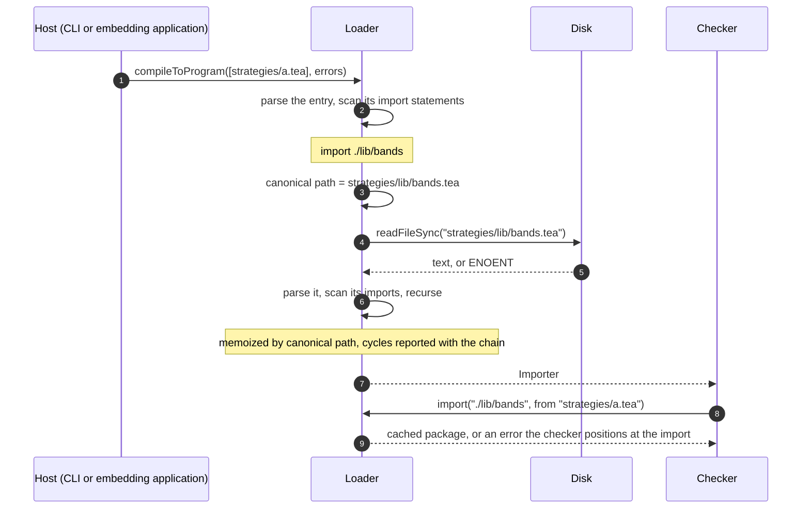

Status: proposed. Today a Tea script can import only the five compiler-shipped
libraries. `compileToProgram` always resolves through `defaultRegistry`, so
`import mylib` fails with `unknown library 'mylib'`, and any path containing `/`
fails with `external libraries are not supported yet`.

This page adds imports of the user's own `.tea` files. The naming rule follows
TypeScript's relative specifiers.

## Decisions

| Question                             | Decision                                                                                               |
| ------------------------------------ | ------------------------------------------------------------------------------------------------------ |
| How does a script name another file? | A relative specifier, `import ./lib/bands`, resolved against the importing file.                       |
| What do other specifiers mean?       | Unchanged. One bare segment is a shipped library. Several bare segments stay `external`.               |
| Who resolves a specifier?            | The loader. The rule is part of the language and identical in every host.                              |
| Who reads the file?                  | The loader, with `readFileSync`, as it already reads entry files and shipped libraries.                |
| Does any tool scan directories?      | No. Imports are followed lazily from the entry file, as the loader already does for shipped libraries. |
| Extensions and probing               | The specifier has no extension and the loader appends `.tea`. One import names exactly one file.       |
| May an import leave a project root?  | Yes. Tea has no project root. Like `tsc` and `node`, the loader reads the path the specifier names.    |

Lazy resolution is what TypeScript, Go, Node, Rust and Python do. A directory
scan finds entry files, such as tsconfig's `include`; it never resolves imports.

## Specifiers

TypeScript's rule: a specifier that starts with `./` or `../` is relative to the
file that contains it, and anything else is a package found by the environment.

| Written                         | Kind              | Resolves to                                               |
| ------------------------------- | ----------------- | --------------------------------------------------------- |
| `import ta`                     | bare, one segment | Compiler-shipped library. Unchanged.                      |
| `import someone/lib/1`          | bare, several     | Published library. Still `external`.                      |
| `import ./lib/bands`            | relative, new     | `lib/bands.tea` beside the importing file.                |
| `import ../shared/risk as risk` | relative, new     | `shared/risk.tea` one directory above the importing file. |

The kind is decided by syntax alone, so a user file can never shadow `ta`.

The local name keeps today's rule. Without `as`, the namespace is the name the
imported file declares in `library("...")`, as Go names a package by its package
clause and not by its path. The imported file must be a library; the checker
already reports `has no library() declaration` otherwise.

## Resolution

```text
canonical path = normalize( dirname(importing file) / specifier + ".tea" )
```

`node:path` does the joining and normalizing. The canonical path is the package
identity, the loader's cache key and the filename in diagnostics. Two files that
reach one library through different spellings share one package. A specifier
inside a library resolves against that library, not against the entry script.

TypeScript probes `.ts`, `.tsx`, `.d.ts`, `index` files and `package.json`. That
serves JavaScript's history. Tea has one candidate per import, so the loader
never asks whether a file or directory exists before reading it.



Resolution needs the importing file, which `Importer.import(path)` does not
receive today. Mature designs all pass both: TypeScript's
`resolveModuleName(name, containingFile, ...)`, Go's
`ImporterFrom.ImportFrom(path, srcDir, mode)` and Rollup's
`resolveId(source, importer)`. Tea's checker follows Go's, so it takes Go's shape.

## Hosts

No host supplies a reader or a registry. A host only has to name its entry file
truthfully.

| Host                        | Entry filename         | Relative imports resolve against |
| --------------------------- | ---------------------- | -------------------------------- |
| `tea run`, `build`, `parse` | The path as typed      | That file's directory.           |
| Embedding application       | The script's real path | That file's directory.           |
| `tea` template tag          | `<tea-template>`       | The process working directory.   |

An embedding application that passes `{filename, source}` sends the real path as
`filename`, even when `source` is newer than the file, as an editor's unsaved
text is.

Reading directly has one known ceiling. An imported file always comes from disk,
so an editor's unsaved edits to it reach its importers only when it is saved.
If that becomes a problem, the loader gains an injected reader then.

## Changes in Tea

1. **Parser.** `importStmt` requires a name after `import` today. It also accepts
   a path that starts with `./` or `../`, still as one atomic path literal.
2. **Importer.** `Importer.import(path, from)` gains the importing file's name.
   The checker passes `stmt.pos.base.filename`; every `Pos` already carries it.
3. **Loader.** A relative specifier is resolved to its canonical path and read
   with `readFileSync`. A bare one goes to `Registry` as today. The cache key
   and `SourcePackage.path` are the canonical path.

`compileToProgram`, the CLI and the `tea` template tag keep their signatures.

One new user-facing error, positioned at the import statement like the existing
ones:

```text
cannot find './lib/bands' (no file strategies/lib/bands.tea)
```

## Verification when implementing

- One library reached through two spellings yields one package.
- A cycle across user files reports the chain with canonical paths.
- A specifier inside a library resolves against the library's directory.
- A missing file reports at the import statement.
- Bare imports and the existing custom-`Registry` tests are unchanged.
- `tea run` compiles a script with a relative import end to end.
