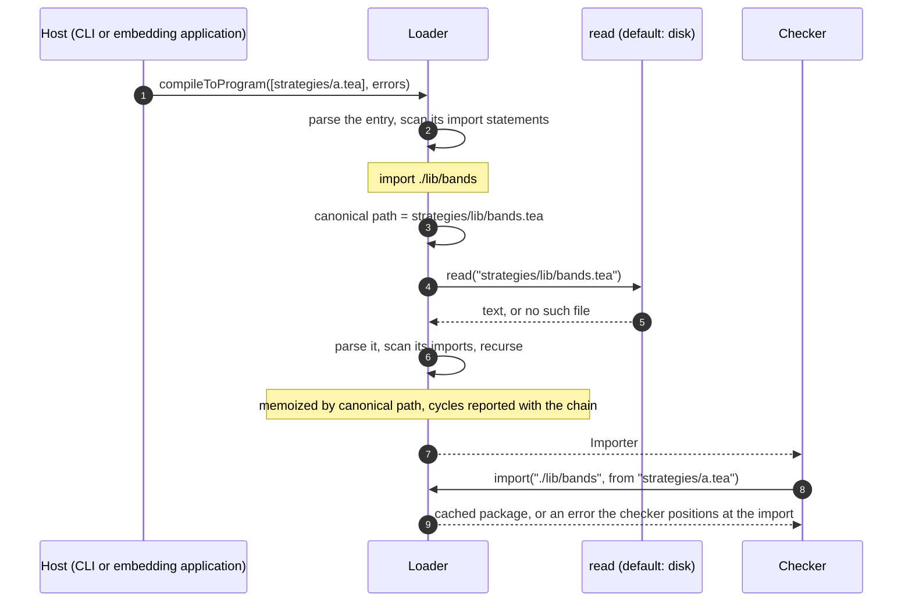

A script imports a compiler-shipped library by name and one of its own files by
a relative path. The naming rule follows TypeScript's relative specifiers: the
language owns how an import names a file, and the loader reads that file.

```tea
import ta
import ./lib/bands
import ../shared/risk as limits

upper = bands.upper(close, 2.0)
emit "capped" limits.cap(upper, 100.0)
```

## Decisions

| Question                             | Decision                                                                                               |
| ------------------------------------ | ------------------------------------------------------------------------------------------------------ |
| How does a script name another file? | A relative specifier, `import ./lib/bands`, resolved against the importing file.                       |
| What do other specifiers mean?       | One bare segment is a shipped library. Several bare segments are `external`, which is not supported.   |
| Who resolves a specifier?            | The loader. The rule is part of the language and identical in every host.                              |
| Who reads the file?                  | The loader, through the compilation's `read` option, which defaults to `readFileSync`.                 |
| Does any tool scan directories?      | No. Imports are followed lazily from the entry file, as the loader already does for shipped libraries. |
| Extensions and probing               | The specifier has no extension and the loader appends `.tea`. One import names exactly one file.       |
| May an import leave a project root?  | Yes. Tea has no project root. Like `tsc` and `node`, the loader reads the path the specifier names.    |

Lazy resolution is what TypeScript, Go, Node, Rust and Python do. A directory
scan finds entry files, such as tsconfig's `include`; it never resolves imports.

## Specifiers

TypeScript's rule: a specifier that starts with `./` or `../` is relative to the
file that contains it, and anything else is a package found by the environment.

| Written                         | Kind              | Resolves to                                               |
| ------------------------------- | ----------------- | --------------------------------------------------------- |
| `import ta`                     | bare, one segment | Compiler-shipped library.                                 |
| `import someone/lib/1`          | bare, several     | Published library. Reported as `external`, not supported. |
| `import ./lib/bands`            | relative          | `lib/bands.tea` beside the importing file.                |
| `import ../shared/risk as risk` | relative          | `shared/risk.tea` one directory above the importing file. |

The kind is decided by spelling alone, so a user file can never shadow `ta`, and
the registry of shipped libraries is never asked about a file.

A relative path is its upward steps first and then names: `./name`,
`../../lib/name`. Each name is a Tea identifier, so a file such as `my-lib.tea`
cannot be imported. `./a/../b` and a trailing `/` are malformed.

The local name keeps the rule of every import. Without `as`, the namespace is
the name the imported file declares in `library("...")`, as Go names a package
by its package clause and not by its path. The imported file must be a library;
the checker reports `has no library() declaration` otherwise.

`import` stays a contextual keyword. Only `./` and `../` open a relative path:
`import.x` still selects from a variable named `import`.

## Resolution

```text
canonical path = normalize( dirname(importing file) / specifier + ".tea" )
```

`node:path` does the joining and normalizing. The canonical path is the package
identity, the loader's cache key and the filename in diagnostics. Two files that
reach one library through different spellings share one package. A specifier
inside a library resolves against that library, not against the entry script.

TypeScript probes `.ts`, `.tsx`, `.d.ts`, `index` files and `package.json`. That
serves JavaScript's history. Tea has one candidate per import, so the loader
never asks whether a file or directory exists before reading it.



Resolution needs the importing file, so `Importer.import(path, from)` takes it.
Mature designs all pass both: TypeScript's
`resolveModuleName(name, containingFile, ...)`, Go's
`ImporterFrom.ImportFrom(path, srcDir, mode)` and Rollup's
`resolveId(source, importer)`. Tea's checker follows Go's, so it takes Go's shape.
The checker passes the name every `Pos` of the statement already carries.

## Hosts

A host names its entry file truthfully and may supply a reader; no host
supplies a registry. `compileToProgram(inputs, errors, {read})` asks
`read(canonicalPath)` for each file a relative import names, once for each
path it finds, and `undefined` reports `cannot find`. Entry files arrive as inputs and
shipped libraries never go through it. A host that stores source itself, such
as a snapshot of a script and its imports, passes each entry as
`{filename, source}` and a map-backed `read`; wrapping the default `read`
during a disk compile records exactly the files the imports reached.

| Host                        | Entry filename         | Relative imports resolve against |
| --------------------------- | ---------------------- | -------------------------------- |
| `tea run`, `build`, `parse` | The path as typed      | That file's directory.           |
| `tea lsp`                   | The `file:` URI's path | That file's directory.           |
| Embedding application       | The script's real path | That file's directory.           |
| `tea` template tag          | `<tea-template>`       | The process working directory.   |

An embedding application that passes `{filename, source}` sends the real path as
`filename`, even when `source` is newer than the file, as an editor's unsaved
text is.

## Errors

Resolution errors sit on the import statement, like those of shipped libraries.

```text
a.tea:1:8: cannot find './lib/bands' (no file strategies/lib/bands.tea)
a.tea:1:8: malformed import path './lib/'
a.tea:1:8: in library 'x/a.tea': in library 'x/b.tea': import cycle: x/a.tea -> x/b.tea -> x/a.tea
```

An error inside an imported file keeps its own position, for example
`lib/plain.tea:1:1: library 'lib/plain.tea' has no library() declaration`. The
language server shows it on the import that names that file, and shows an error
in an imported function's body on the call that reached it.

## Known ceilings

- `tea lsp` passes no reader, so an editor's unsaved edits to an imported file
  reach its importers only when it is saved.
- A struct or enum exported from an imported file carries its canonical path in
  its `tea:typeId`. Hosts that name the entry differently, by a relative or an
  absolute path, therefore produce different ids for the same type.

## Verified by

- `src/loader/loader.test.ts`: two spellings yield one package, a cycle names
  its chain by canonical path, a missing file and a malformed path, and the
  registry is never asked about a file.
- `src/compiler.test.ts`: a script runs with its own library files and its
  generated TypeScript typechecks; resolution errors sit on the import; an
  injected `read` supplies every import by canonical path, once each, with no
  file on disk.
- `src/syntax/parser.test.ts`: a relative path is one atomic literal, and
  `import` stays an ordinary name elsewhere.
- `src/cli/main.integration.test.ts`: `tea build` follows relative imports.
- `src/lsp`: definition leads into the imported file as a `file:` location, a
  missing file is marked on the whole import path, and an error at the top of
  an imported file is marked on its import.
